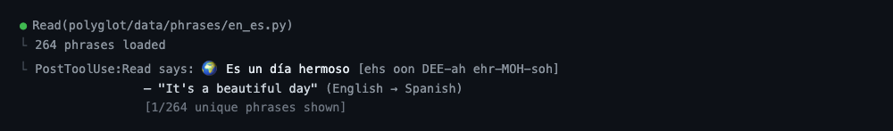

# Polyglot

**Learn a language in the pauses between agent turns.**

[](https://polyglot-5os.pages.dev/#ambient)

*An actual Claude Code 2.1.218 + Opus 4.8 session. The 11-second hero cut
accelerates the work, then highlights and holds the real Polyglot Stop phrase
for four seconds. The signed-in account is redacted.*

Polyglot puts one useful word or phrase inside your Codex or Claude Code
session every few completed turns. Instead of staring at terminal churn while
an agent works, you collect small language-learning moments that add up—without
an extra tab, streak pressure, or sending your conversation anywhere.

The 74 language directions, 19,281 bundled entries, interactive terminal
cabinet, typed recall, and local spaced repetition support that ambient moment.
They are available when you want deliberate study, but they are secondary.

[Visit the Polyglot landing page](https://polyglot-5os.pages.dev/).



## What it feels like

```text
$ polyglot sample --pair en-es

🌍 hola  [oh-LAH]
   — "hello" (English → Spanish)
   [1/264 unique phrases shown]
```

Polyglot remembers the active pair and recently shown entries, prioritizing
unseen material before repeats. For deliberate study, `review` uses typed
retrieval, explicit grades, and local due scheduling; no agent transcript is
treated as learner evidence.

## Demo video

[Watch the full-resolution terminal demo](https://polyglot-5os.pages.dev/#ambient).

The recording comes from the disposable `fix-friday-deploys-before-standup`
Rust project. Claude fixes the deployment guard, adds the Friday regression
test, and passes all three tests before the real Stop hook displays
`Polyglot starter · hello → hallo`. Setup and tool work are compressed; the
phrase itself receives a four-second highlighted zoom. No tool call, edit,
test result, response, or phrase was synthesized.

The landing-page source lives in [`site/`](site/), including a dependency-free
Pagecast-safe handoff in `site/pagecast/`. It documents the verified adapter
boundary rather than making host-native guarantees.

## Install

### Codex Desktop and CLI

```bash
codex plugin marketplace add Amal-David/polyglot
codex plugin add polyglot@polyglot
```

Polyglot is packaged as a Codex plugin with a skill and a fail-soft `Stop`
hook. Codex shares plugin configuration across its app and CLI surfaces; the
hook returns a compact `systemMessage` when the local cadence is due.

### Claude Code

```bash
claude plugin marketplace add Amal-David/polyglot
claude plugin install polyglot@polyglot
```

The marketplace validates strictly with Claude Code 2.1.212 and declares the
same optional `Stop` cadence used by the Codex integration.

### Pi

```bash
pi install git:github.com/Amal-David/polyglot
```

Pi 0.57 installs and lists the canonical skill and native extension from an
isolated home. Live command handling and `agent_end` presentation are not
claimed.

### Hermes Agent

```bash
hermes plugins install Amal-David/polyglot --enable
```

Hermes 0.16 installs and loads Polyglot from a clean working directory,
registering `polyglot:polyglot`, the optional output hook, and the `/polyglot`
configuration command. Live authenticated output presentation is not claimed.

### Python CLI

```bash
git clone https://github.com/Amal-David/polyglot.git
cd polyglot
python3 -m pip install .
```

The distribution is named `ambient-polyglot`; the import package and command
are both `polyglot`. It requires Python 3.10+ and has no Python runtime
dependencies.

## On demand vs. ambient

On-demand use is available immediately after installing the skill. Ambient
mode is deliberately disabled until you request it:

```bash
polyglot ambient enable --pair en-es --cadence 5
polyglot ambient status
polyglot ambient disable
```

For a pair with no learner state, the first due cadence can show one labelled
starter exposure, such as `Polyglot starter · hello → hallo`. This records only
that the starter was displayed; it creates no learner schedule or review
history. Polyglot then waits for an explicit `polyglot review`. Once learner
state exists, ambient mode is due-only and never grades or reschedules a card.
`polyglot ambient status` reports `starter`, `waiting`, or `due-ready` with the
next action.

Inside Pi or Hermes:

```text
/polyglot enable en-es 5
/polyglot status
/polyglot sample
/polyglot disable
```

The Codex and Claude skills can configure the same state using the bundled
standard-library script, so a separate Python package install is not required
for their plugin installs. Their manifests explicitly point at
`scripts/ambient.py`; it resolves the installed plugin root and never relies
on a globally installed `polyglot` command. The older
`polyglot.skill.hook` import remains only as a deprecated compatibility path.

### Host support

| Host | Packaged integration |
|---|---|
| Codex Desktop + CLI | plugin skill and fail-soft `Stop` hook |
| Claude Code 2.1.212 | strictly validated optional `Stop` adapter |
| Pi 0.57 | canonical skill and native `agent_end` extension |
| Hermes 0.16 | namespaced skill, hook, and configuration command |

Every adapter catches its own failures so Polyglot cannot break an agent turn.
Host child processes receive only an explicit runtime, locale, and
temporary-home allowlist; credentials, prompts, transcripts, paths, source
code, tool arguments, and learner history are never ambient payload data.

## CLI

```bash
polyglot                         # interactive 74-pair cabinet
polyglot pairs                   # list pair ids
polyglot pairs --json
polyglot pair en-ja              # set active pair
polyglot sample                  # sample from active pair
polyglot sample --pair es-en
polyglot sample --pair en-ko --json
polyglot ambient enable --pair en-fr --cadence 10
```

The direction catalog contains:

- 52 English-to-language directions.
- 22 language-to-English directions, including Polish → English (264),
  Ukrainian → English (265), Swedish → English (261), and Greek → English
  (256), mechanically derived from existing shipped records.
- Script, vocabulary, phrase, and sentence categories.
- Pronunciation hints and contextual notes where available.

## V2 learning paths and catalog provenance

German was already present in both directions; v2 deepens `en-de` and `de-en`
with a conservative first-class learning path rather than marketing it as a
new language. Each German card has a stable record ID, locale/script and
register facts, a staged beginner route, typed-recall routing, and—where a safe
deterministic rule exists—an exact-text contextual cloze. The Latin-script
German route starts with useful social language, then foundations, core
vocabulary, practical phrases, sentences, and finally redundant alphabet
material; catalog order is preserved inside each stage. Due cards always come
first and sessions never duplicate a card. Article/gender facts are limited to
exact known lemmas. Automated grammar, register, and cloze annotations are
explicitly **not native-speaker reviewed**.

The four new reverse directions preserve their original Latin, Cyrillic, or
Greek source text. Their legacy reading hints are retained only as legacy
rendering hints, never presented as transliteration or reverse-direction
pronunciation. No translation was generated for this expansion.

The [2025 Duolingo Language Report](https://blog.duolingo.com/2025-duolingo-language-report/)
reports English as its most-studied language and German fifth globally. That
is demand context, not an official "top 20" claim: the choices above close
direction gaps while retaining the existing demand-core catalog.

## Educational content, not authoritative translation

Polyglot is designed for lightweight exposure and practice. Its translations,
romanizations, stress hints, and usage notes are educational content. They are
not a substitute for a qualified human translator or native-speaker review.

Do not rely on the bundled collection for medical, legal, emergency,
immigration, financial, safety-critical, or similarly consequential
communication.

## Correct a phrase

Native speakers and language educators are especially welcome. Please open a
**Language correction** issue with:

- Pair id, such as `en-es`.
- Exact source and target currently shown.
- Proposed correction.
- Region, register, or script context.
- A short source or rationale when possible.

See [DATA.md](DATA.md) for provenance, limitations, and the correction review
policy. Corrections should improve the source dataset and its tests rather than
patching generated output at runtime.

## Development

```bash
python3 -m unittest discover -s tests -v
python3 -m compileall -q polyglot scripts tests
python3 -m pip wheel . --no-deps --no-build-isolation --wheel-dir dist
python3 scripts/check_wheel_install.py dist/ambient_polyglot-*.whl
```

The repository also contains manifests for Codex, Claude Code, Pi, and Hermes.
Host-specific validation requires the corresponding host CLI; unit tests cover
the shared contracts and failure isolation.

## License

[MIT](LICENSE)
